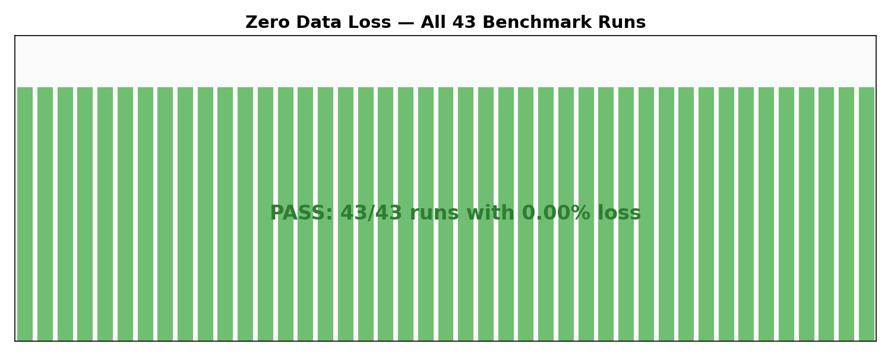
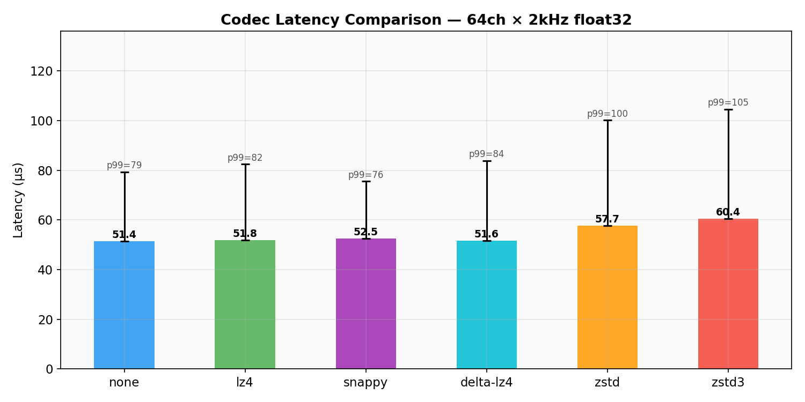
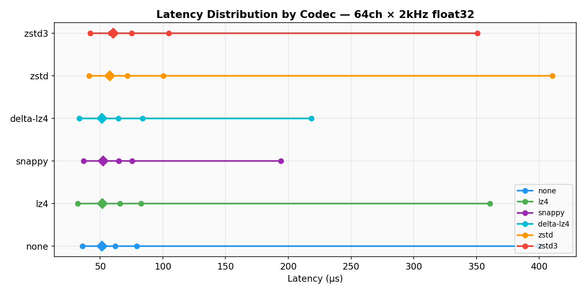
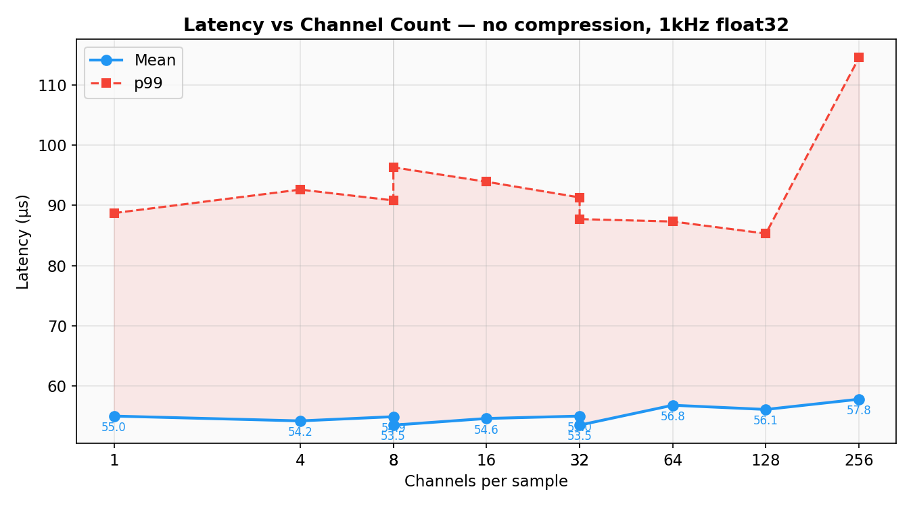
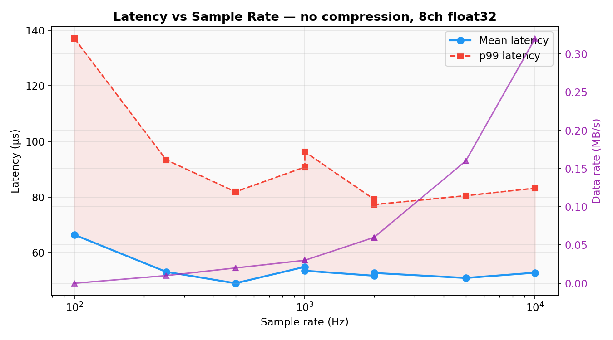
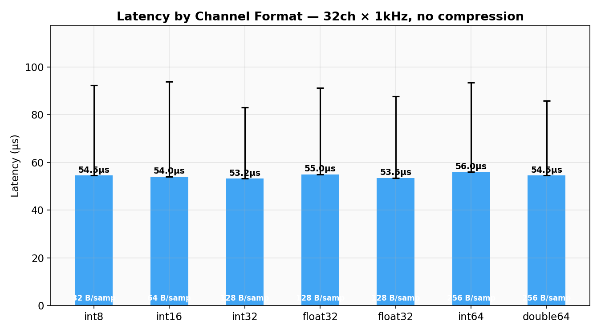
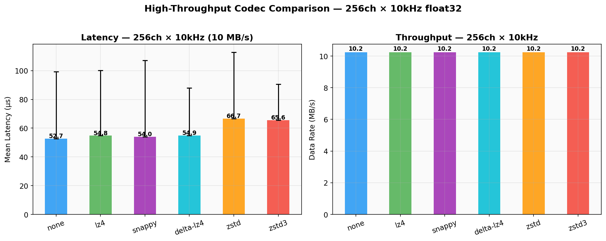
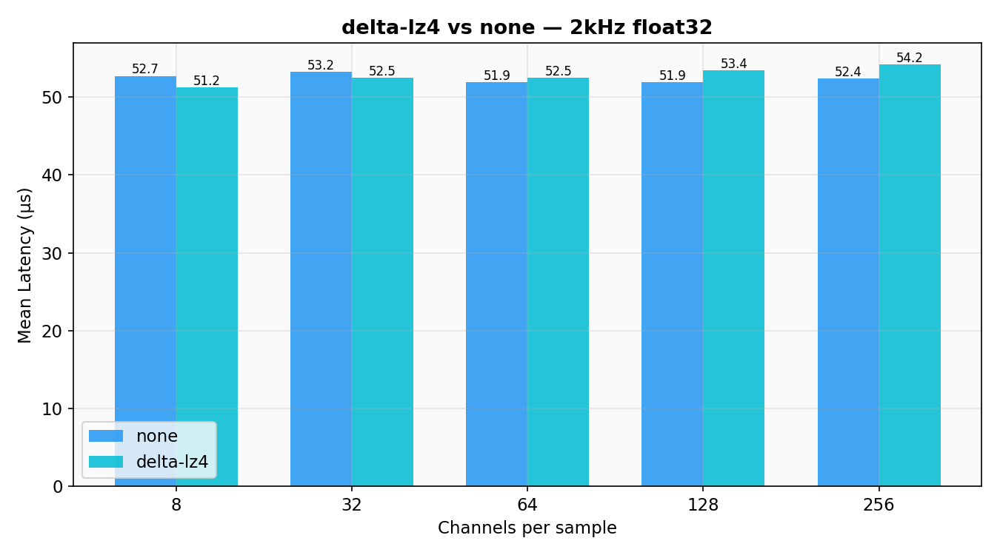

# rlsl-iroh

Tunnel [LSL](https://labstreaminglayer.org/) streams over [iroh](https://iroh.computer/) peer-to-peer QUIC connections.

The existing LSL TCP/UDP infrastructure is **untouched** — legacy clients always work. This crate adds a parallel transport path for streaming across NATs, VPNs, and the open internet.

## Architecture

```
  Machine A (source)                    Machine B (sink)
  ┌─────────────────┐                  ┌─────────────────┐
  │  LSL Outlet      │ ◄── normal ───► │  LSL Client      │
  │  (TCP/UDP)       │     LSL         │  (LabRecorder…)  │
  │        │         │                 │        ▲         │
  │        ▼         │                 │        │         │
  │  StreamInlet     │                 │  StreamOutlet    │
  │        │         │                 │        ▲         │
  │        ▼         │                 │        │         │
  │  rlsl-iroh       │ ══ iroh QUIC ══►│  rlsl-iroh       │
  │  source          │    (P2P/relay)  │  sink             │
  └─────────────────┘                  └─────────────────┘
```

## Quick start

```sh
# On the receiver machine:
rlsl-iroh sink

# On the sender machine:
rlsl-iroh source --sink <NODE_ID>

# With compression:
rlsl-iroh source --sink <NODE_ID> --compress delta-lz4
```

## Compression codecs

| Flag | Codec | Speed | Ratio | Best for |
|---|---|---|---|---|
| `none` | — | — | 1.0× | LAN / localhost (default) |
| `lz4` | LZ4 block | ~3 GB/s | 1.5–2× | General low overhead |
| `zstd` | Zstandard L1 | ~800 MB/s | 2–3× | Balanced |
| `zstd3` | Zstandard L3 | ~400 MB/s | 2.5–4× | Bandwidth-limited |
| `snappy` | Snappy | ~2 GB/s | 1.5–2× | Google compat |
| `delta-lz4` | XOR-delta + LZ4 | ~2 GB/s | 3–8× | Physiological signals |

## Benchmarks

All benchmarks run in-process (two iroh endpoints on the same machine, QUIC over localhost UDP). Raw data in [`figures/bench_data.csv`](../../figures/bench_data.csv). Reproduce with:

```sh
./figures/run_benchmarks.sh     # collect data
python3 figures/plot_benchmarks.py  # generate charts
```

### Zero data loss

**43/43 benchmark runs: 0.00% sample loss** across all codecs, channel counts (1–256), sample rates (100 Hz–10 kHz), and formats (int8–double64).



### Codec latency comparison

64 channels × 2 kHz, float32. Bars = mean, error bars = p99. All codecs add negligible latency (~1–9 µs over baseline). LZ4, Snappy, and delta-LZ4 are effectively free. Zstd adds ~6–9 µs due to its heavier encoder.



### Latency distribution by codec

Same data as above, showing min → p50 → mean → p95 → p99 → max spread. Diamond = mean.



### Latency vs channel count

No compression, 1 kHz float32. Mean latency stays flat at ~55 µs from 1 to 256 channels — dominated by QUIC RTT, not payload size.



### Latency vs sample rate

No compression, 8 channels float32. Latency is stable from 250 Hz to 10 kHz. The 100 Hz outlier is due to QUIC's initial RTT estimate settling.



### Latency by channel format

32 channels × 1 kHz, no compression. All formats (int8 through double64) deliver the same ~54 µs mean — serialization overhead is negligible relative to QUIC transport.



### High-throughput codec comparison

256 channels × 10 kHz = **10.24 MB/s** raw throughput. All codecs sustain full rate with zero loss. Zstd adds ~12 µs mean overhead at this load; LZ4/Snappy/delta-LZ4 stay within ~2 µs of baseline.



### delta-lz4 vs none at scale

Side-by-side at increasing channel counts (2 kHz float32). delta-LZ4 adds no measurable latency overhead — the XOR + LZ4 pipeline runs faster than a single QUIC round-trip.



### Summary table

| Config | Mean | p50 | p95 | p99 | Max | Throughput |
|---|---|---|---|---|---|---|
| 8ch × 1kHz, none | 53.5 µs | 53.0 µs | 63.9 µs | 96.3 µs | 214 µs | 1,000 s/s |
| 64ch × 2kHz, none | 51.4 µs | 52.6 µs | 62.2 µs | 79.3 µs | 400 µs | 2,000 s/s |
| 64ch × 2kHz, lz4 | 51.8 µs | 51.8 µs | 65.8 µs | 82.5 µs | 361 µs | 2,000 s/s |
| 64ch × 2kHz, delta-lz4 | 51.6 µs | 51.7 µs | 64.4 µs | 83.9 µs | 218 µs | 2,000 s/s |
| 256ch × 10kHz, none | 52.7 µs | 52.4 µs | 64.4 µs | 99.2 µs | 434 µs | 10,000 s/s |
| 256ch × 10kHz, delta-lz4 | 54.9 µs | 53.9 µs | 69.0 µs | 87.9 µs | 243 µs | 10,000 s/s |

## Zero data loss guarantee

The default reliable mode uses QUIC ordered streams with:
- Unbounded internal channel (back-pressure from QUIC, not sample drops)
- 32768-sample inlet buffer (~130s at 250 Hz)
- Automatic pulled/sent accounting with error logging on mismatch
- Bench exits with code 1 if any loss detected

## Low-latency QUIC tuning

Both source and sink apply `low_latency_transport()`:
- **ACK every packet** (ack_eliciting_threshold=1, max_ack_delay=0)
- **1 ms initial RTT** (vs default 333 ms) for fast congestion window ramp
- **2 MB send/receive windows** to avoid flow-control stalls

## Lossy datagram mode (opt-in)

```sh
cargo build --release -p rlsl-iroh --features lossy-datagrams
rlsl-iroh source --sink <NODE_ID> --datagrams
```

Only available with `--features lossy-datagrams`. Will drop samples under congestion.

## License

GPL-3.0-only
